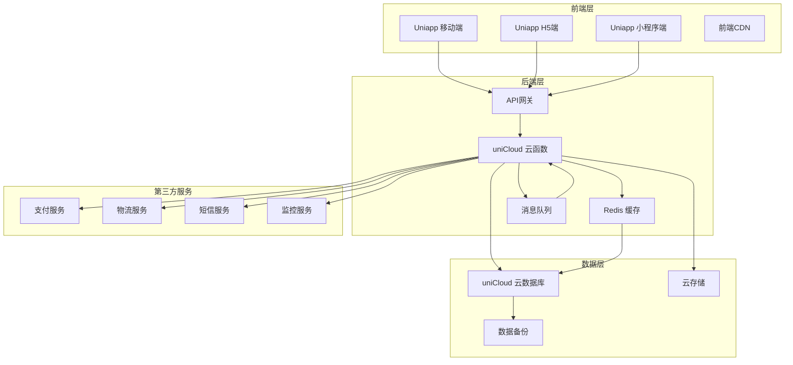

# 方案优化与提升建议

## 1. 当前方案分析

### 1.1 优势
- ✅ 完整的功能覆盖：涵盖ERP系统核心模块
- ✅ 技术栈合理：Uniapp + uniCloud + Vue3 + TypeScript
- ✅ 多端支持：一套代码多端发布
- ✅ 详细的文档：产品需求、技术架构、数据库设计、API接口
- ✅ 多店铺支持：完善的多店铺管理和数据隔离

### 1.2 不足
- ❌ 缺少具体的性能优化策略
- ❌ 缺少安全防护措施
- ❌ 缺少具体的测试计划
- ❌ 缺少部署和运维方案
- ❌ 缺少扩展性考虑
- ❌ 缺少具体的开发任务分解
- ❌ 缺少用户体验优化建议
- ❌ 缺少数据备份和恢复策略
- ❌ 缺少系统监控方案
- ❌ 缺少与第三方系统集成的考虑

## 2. 优化建议

### 2.1 性能优化

#### 前端优化
- **代码分割**：使用动态导入实现路由级别的代码分割
- **缓存策略**：实现三级缓存（内存缓存、本地存储、IndexedDB）
- **图片优化**：使用WebP格式、图片懒加载、CDN加速
- **网络优化**：使用HTTP/2、HTTP/3，实现请求合并和防抖
- **渲染优化**：使用虚拟列表、骨架屏、减少重排重绘

#### 后端优化
- **云函数优化**：使用云函数集群、冷启动优化
- **数据库优化**：合理创建索引、使用聚合查询、避免全表扫描
- **缓存机制**：实现Redis缓存层，缓存热点数据
- **批量操作**：优化批量数据处理，减少数据库操作次数
- **API优化**：实现API网关、限流、熔断机制

### 2.2 安全防护

#### 前端安全
- **XSS防护**：实现输入验证、输出编码
- **CSRF防护**：使用token验证
- **敏感数据保护**：加密存储敏感信息
- **权限控制**：前端路由守卫，防止未授权访问

#### 后端安全
- **身份认证**：使用JWT + 双因素认证
- **权限管理**：基于RBAC的细粒度权限控制
- **数据安全**：数据加密存储、传输加密
- **API安全**：接口限流、参数验证、防止SQL注入
- **日志审计**：详细的操作日志，便于安全审计

### 2.3 用户体验优化

#### 界面设计
- **响应式设计**：适配不同设备尺寸
- **无障碍设计**：支持屏幕阅读器、键盘导航
- **深色模式**：支持明暗主题切换
- **动画效果**：流畅的过渡动画，提升用户体验
- **微交互**：按钮反馈、加载状态、错误提示

#### 交互流程
- **简化操作**：减少操作步骤，优化用户流程
- **智能推荐**：基于用户行为的智能推荐
- **批量操作**：支持批量处理，提高工作效率
- **快捷键**：常用操作支持键盘快捷键
- **离线功能**：关键功能支持离线操作

### 2.4 扩展性设计

#### 架构扩展
- **插件系统**：支持功能插件化，便于扩展
- **微服务架构**：核心功能模块化，独立部署
- **API网关**：统一API管理，便于集成
- **配置中心**：集中管理配置，支持动态配置

#### 业务扩展
- **自定义字段**：支持业务字段自定义
- **工作流引擎**：支持业务流程自定义
- **报表引擎**：支持自定义报表
- **多语言支持**：国际化和本地化

### 2.5 运维与监控

#### 部署方案
- **容器化部署**：使用Docker容器化部署
- **CI/CD**：自动化构建、测试、部署
- **环境管理**：开发、测试、生产环境隔离
- **版本管理**：代码版本控制、数据库版本管理

#### 监控方案
- **系统监控**：服务器、数据库、云函数监控
- **应用监控**：API调用、错误率、响应时间
- **业务监控**：销售数据、库存预警、异常交易
- **日志管理**：集中式日志管理，支持日志分析

#### 数据备份
- **自动备份**：定期自动备份数据库
- **增量备份**：支持增量备份，减少备份时间
- **异地备份**：多地域备份，提高数据安全性
- **恢复测试**：定期测试数据恢复流程

### 2.6 第三方集成

#### 支付集成
- **主流支付**：微信支付、支付宝、银行卡支付
- **聚合支付**：支持多种支付方式
- **支付安全**：符合PCI DSS安全标准

#### 物流集成
- **快递接口**：对接主流快递公司API
- **物流跟踪**：实时物流状态更新
- **电子面单**：支持电子面单打印

#### 其他集成
- **短信服务**：验证码、通知短信
- **邮件服务**：业务通知、报表邮件
- **CRM系统**：客户关系管理集成
- **电商平台**：对接主流电商平台

## 3. 优化后的技术架构

### 3.1 架构图

### 3.2 技术栈优化

| 类别 | 技术 | 版本 | 用途 |
|------|------|------|------|
| 前端框架 | Uniapp | 3.x | 跨平台应用开发 |
| 前端语言 | Vue3 + TypeScript | 3.x | 类型安全的前端开发 |
| 状态管理 | Pinia | 2.x | 轻量级状态管理 |
| UI组件库 | uView Plus + uni-ui | 3.x | 移动端UI组件 |
| 网络请求 | uni.request + Axios | - | API调用 |
| 后端服务 | uniCloud | - | Serverless云函数 |
| 数据库 | uniCloud DB (MongoDB) | - | 云数据库 |
| 缓存 | Redis | 7.x | 缓存热点数据 |
| 消息队列 | uniCloud 消息队列 | - | 异步任务处理 |
| 监控 | Sentry | - | 错误监控 |
| 部署 | Docker + CI/CD | - | 容器化部署 |

## 4. 功能模块优化

### 4.1 店铺管理
- ✅ 店铺信息管理
- ✅ 店铺员工管理
- ✅ 店铺权限配置
- ➕ 店铺分组管理
- ➕ 店铺业绩对比
- ➕ 店铺设置模板

### 4.2 商品管理
- ✅ 商品分类管理
- ✅ 商品档案管理
- ✅ 供应商管理
- ✅ 价格管理
- ➕ 商品变体管理
- ➕ 商品条码批量生成
- ➕ 商品图片批量上传
- ➕ 商品导入导出

### 4.3 库存管理
- ✅ 实时库存查询
- ✅ 入库/出库管理
- ✅ 库存盘点
- ✅ 库存调拨
- ✅ 库存预警
- ➕ 库存批次管理
- ➕ 库存保质期管理
- ➕ 库存成本核算
- ➕ 库存周转率分析

### 4.4 销售管理
- ✅ POS收银台
- ✅ 销售订单管理
- ✅ 销售退货处理
- ✅ 会员管理
- ➕ 销售促销管理
- ➕ 销售优惠券管理
- ➕ 销售提成管理
- ➕ 销售数据分析

### 4.5 财务管理
- ✅ 销售统计分析
- ✅ 收支管理
- ✅ 利润分析
- ✅ 对账单管理
- ➕ 财务报表
- ➕ 税务管理
- ➕ 发票管理
- ➕ 预算管理

### 4.6 报表分析
- ✅ 销售报表
- ✅ 库存报表
- ✅ 财务报表
- ✅ 员工业绩报表
- ➕ 自定义报表
- ➕ 数据大屏
- ➕ 趋势分析
- ➕ 预测分析

### 4.7 系统设置
- ✅ 系统配置
- ✅ 数据字典
- ✅ 操作日志
- ✅ 数据备份
- ➕ 系统监控
- ➕ 通知管理
- ➕ 集成管理
- ➕ 权限模板
