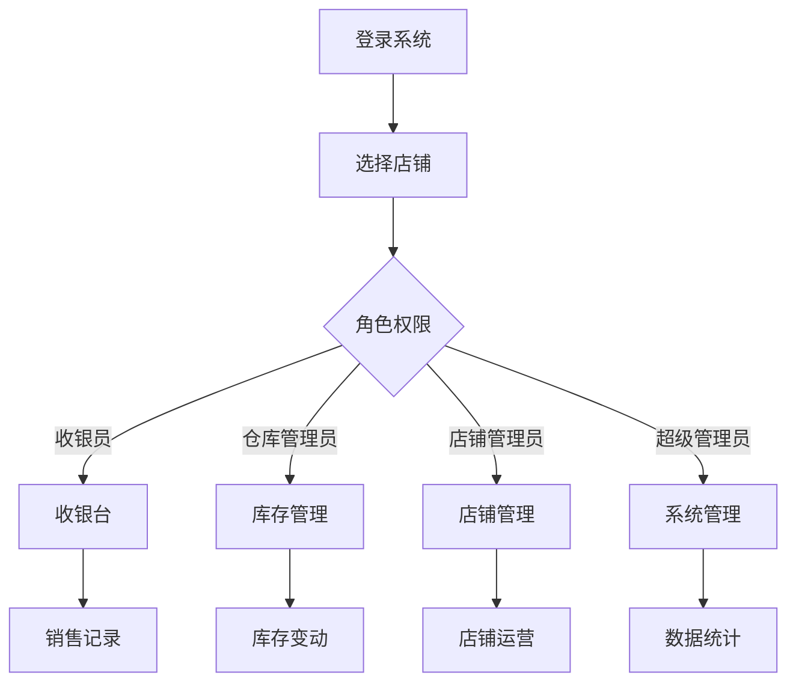

# 多店铺手机实体店铺ERP系统 - 产品需求文档

## 1. 产品概述

多店铺手机实体店铺ERP系统是一套完整的企业资源管理解决方案，专为手机零售行业设计，支持多店铺管理、库存同步、销售管理、财务管理等核心功能。
- 解决手机零售行业多店铺管理、库存分散、数据孤岛等问题
- 提升门店运营效率，降低库存成本，优化供应链管理

## 2. 核心功能

### 2.1 用户角色

| 角色 | 注册方法 | 核心权限 |
|------|----------|----------|
| 超级管理员 | 系统初始化创建 | 全系统管理权限、店铺管理、用户管理、数据备份 |
| 店铺管理员 | 超级管理员创建 | 单店铺管理权限、员工管理、商品管理、销售管理 |
| 收银员 | 店铺管理员创建 | 收银操作、会员查询、销售记录查看 |
| 仓库管理员 | 店铺管理员创建 | 库存管理、入库出库、盘点操作 |

### 2.2 功能模块

1. **店铺管理模块**: 店铺信息管理、店铺员工管理、店铺权限配置
2. **商品管理模块**: 商品分类、商品档案、供应商管理、价格管理
3. **库存管理模块**: 库存查询、入库管理、出库管理、盘点管理、库存调拨
4. **销售管理模块**: 收银台、销售订单、销售退货、会员管理
5. **财务管理模块**: 销售统计、收支管理、利润分析、对账单
6. **报表分析模块**: 销售报表、库存报表、财务报表、员工业绩报表
7. **系统设置模块**: 系统配置、数据字典、操作日志、数据备份

### 2.3 页面详情

| 页面名称 | 模块名称 | 功能描述 |
|---------|---------|---------|
| 登录页 | 用户认证 | 用户登录、密码找回、记住登录状态 |
| 工作台首页 | 工作台 | 数据概览、待办事项、快捷入口、销售趋势图 |
| 店铺列表 | 店铺管理 | 店铺列表展示、新增店铺、编辑店铺、禁用/启用店铺 |
| 员工管理 | 店铺管理 | 员工列表、新增员工、角色分配、权限设置 |
| 商品分类 | 商品管理 | 分类树形结构、新增分类、编辑分类、删除分类 |
| 商品档案 | 商品管理 | 商品列表、商品搜索、新增商品、批量导入、价格调整 |
| 供应商管理 | 商品管理 | 供应商列表、新增供应商、供应商信息编辑 |
| 库存查询 | 库存管理 | 实时库存、多店铺库存对比、库存预警 |
| 入库管理 | 库存管理 | 入库单创建、入库审核、入库记录查询 |
| 出库管理 | 库存管理 | 出库单创建、出库审核、出库记录查询 |
| 盘点管理 | 库存管理 | 盘点单创建、盘点录入、盘点差异处理 |
| 收银台 | 销售管理 | 商品扫码、会员识别、多种支付方式、小票打印 |
| 销售订单 | 销售管理 | 订单列表、订单详情、订单状态跟踪 |
| 销售退货 | 销售管理 | 退货申请、退货审核、退款处理 |
| 会员管理 | 销售管理 | 会员列表、会员等级、会员积分、会员消费记录 |
| 销售统计 | 财务管理 | 日/周/月销售统计、销售趋势分析、店铺对比 |
| 收支管理 | 财务管理 | 收入记录、支出记录、收支明细、账户管理 |
| 利润分析 | 财务管理 | 毛利率分析、成本分析、利润趋势 |
| 销售报表 | 报表分析 | 多维度销售报表、导出功能 |
| 库存报表 | 报表分析 | 库存周转率、滞销品分析、库存价值报表 |
| 系统设置 | 系统设置 | 基本参数配置、打印模板设置、消息通知设置 |
| 操作日志 | 系统设置 | 操作记录查询、操作详情查看 |

## 3. 核心流程

### 3.1 销售收银流程
顾客到店选购商品 → 收银员扫码商品 → 系统自动计算金额 → 识别会员(可选) → 选择支付方式 → 完成支付 → 打印小票 → 更新库存

### 3.2 商品入库流程
创建入库单 → 选择供应商 → 录入商品明细 → 提交审核 → 仓库管理员审核 → 确认入库 → 更新库存 → 生成入库记录

### 3.3 库存盘点流程
创建盘点单 → 选择盘点仓库 → 生成盘点任务 → 盘点人员录入实盘数量 → 系统计算差异 → 差异审核 → 确认调整库存 → 生成盘点报告

## 4. 用户界面设计

### 4.1 设计风格
- **主色调**: 科技蓝 (#1890FF) 搭配 商务灰 (#F0F2F5)
- **辅助色**: 成功绿 (#52C41A)、警告橙 (#FAAD14)、错误红 (#F5222D)
- **按钮风格**: 圆角矩形，主按钮使用渐变效果，次要按钮使用描边样式
- **字体**: 系统默认字体，标题使用粗体，正文使用常规字重
- **布局风格**: 卡片式布局，左侧导航栏，顶部状态栏，内容区域自适应
- **图标风格**: 使用线性图标，保持24x24px统一尺寸

### 4.2 页面设计概述

| 页面名称 | 模块名称 | UI元素 |
|---------|---------|-------|
| 工作台首页 | 工作台 | 顶部数据卡片(销售额、订单量、客流量)、折线图展示销售趋势、待办事项列表、快捷功能入口、卡片式布局、蓝灰配色 |
| 收银台 | 销售管理 | 商品扫描区域、购物车列表、金额统计面板、会员信息卡片、支付方式选择、键盘快捷键提示、深色主题、大按钮设计 |
| 商品档案 | 商品管理 | 搜索筛选栏、商品卡片网格布局、商品图片、名称、价格、库存显示、批量操作工具栏、分页组件、卡片悬浮效果 |
| 库存查询 | 库存管理 | 多店铺筛选、库存表格展示、库存预警标识、库存进度条、筛选条件面板、导出功能按钮、表格斑马纹 |

### 4.3 响应式设计
- **移动优先**: 采用移动优先设计理念，适配手机、平板等移动设备
- **触摸优化**: 按钮尺寸≥44x44px，确保触摸操作的准确性
- **横竖屏适配**: 支持横竖屏自动切换，优化布局显示
- **离线缓存**: 关键数据支持本地缓存，确保网络不佳时仍可正常收银

### 4.4 性能优化
- **图片懒加载**: 商品图片使用懒加载技术，提升页面加载速度
- **数据分页**: 列表数据使用分页加载，避免一次性加载大量数据
- **缓存策略**: 合理使用本地缓存，减少网络请求
- **动画优化**: 使用CSS3硬件加速，确保动画流畅
