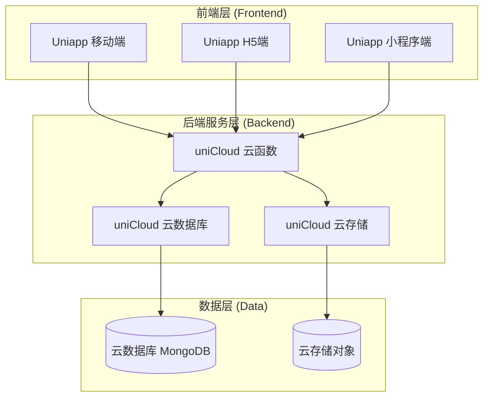
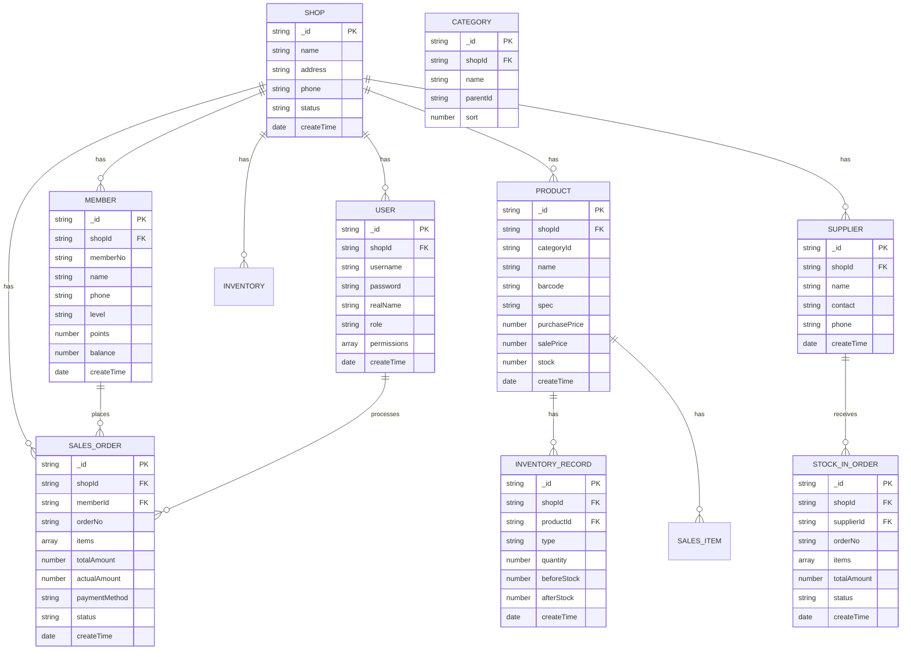

# 多店铺手机实体店铺ERP系统 - 技术架构文档

## 1. 架构设计



## 2. 技术描述

### 2.1 技术栈选择

- **前端框架**: Uniapp (Vue3 + TypeScript)
- **UI组件库**: uView Plus / uni-ui
- **状态管理**: Pinia
- **后端服务**: uniCloud (阿里云版/腾讯云版)
- **数据库**: uniCloud 云数据库 (MongoDB 兼容)
- **文件存储**: uniCloud 云存储
- **构建工具**: Vite
- **代码规范**: ESLint + Prettier

### 2.2 技术选型理由

- **Uniapp**: 一套代码多端发布，支持移动端App、H5、小程序，满足手机实体店铺多场景使用需求
- **uniCloud**: 开箱即用的Serverless架构，无需运维服务器，降低开发和运营成本
- **Vue3 + TypeScript**: 类型安全，提升代码可维护性和开发效率
- **uView Plus**: 专为Uniapp打造的UI组件库，组件丰富，文档完善

## 3. 项目结构

```
/workspace/
├── doc/                          # 文档目录
│   ├── prd.md                   # 产品需求文档
│   └── technical-architecture.md # 技术架构文档
├── src/                          # 源代码目录
│   ├── pages/                    # 页面目录
│   │   ├── index/               # 首页/工作台
│   │   ├── shop/                # 店铺管理
│   │   ├── product/             # 商品管理
│   │   ├── inventory/           # 库存管理
│   │   ├── sales/               # 销售管理
│   │   ├── finance/             # 财务管理
│   │   ├── report/              # 报表分析
│   │   └── settings/            # 系统设置
│   ├── components/               # 公共组件
│   │   ├── layout/              # 布局组件
│   │   ├── form/                # 表单组件
│   │   └── business/            # 业务组件
│   ├── api/                      # API接口
│   │   ├── request.ts           # 请求封装
│   │   └── modules/             # 接口模块
│   ├── store/                    # 状态管理
│   │   ├── index.ts             # store入口
│   │   └── modules/             # store模块
│   ├── utils/                    # 工具函数
│   │   ├── auth.ts              # 认证工具
│   │   ├── storage.ts           # 存储工具
│   │   └── validate.ts          # 验证工具
│   ├── types/                    # TypeScript类型定义
│   ├── static/                   # 静态资源
│   ├── App.vue                   # 应用入口
│   ├── main.ts                   # 主入口文件
│   ├── manifest.json             # 应用配置
│   ├── pages.json                # 页面路由配置
│   └── uni.scss                  # 全局样式
├── uniCloud-aliyun/              # 阿里云版云函数
│   ├── cloudfunctions/           # 云函数目录
│   │   ├── user/                 # 用户相关云函数
│   │   ├── shop/                 # 店铺相关云函数
│   │   ├── product/              # 商品相关云函数
│   │   ├── inventory/            # 库存相关云函数
│   │   ├── sales/                # 销售相关云函数
│   │   ├── finance/              # 财务相关云函数
│   │   └── common/               # 公共云函数
│   └── database/                 # 数据库Schema
│       └── schema/               # 数据库表结构定义
├── uni_modules/                  # uni_modules插件
├── .eslintrc.js                  # ESLint配置
├── .prettierrc                   # Prettier配置
├── tsconfig.json                 # TypeScript配置
├── vite.config.ts                # Vite配置
├── package.json                  # 项目依赖
└── README.md                     # 项目说明
```

## 4. 页面路由定义

| 路由路径 | 页面名称 | 模块 | 说明 |
|---------|---------|------|------|
| /pages/index/index | 工作台首页 | 工作台 | 数据概览、快捷入口 |
| /pages/login/login | 登录页 | 用户认证 | 用户登录 |
| /pages/shop/list | 店铺列表 | 店铺管理 | 店铺列表展示 |
| /pages/shop/detail | 店铺详情 | 店铺管理 | 店铺详情编辑 |
| /pages/shop/staff | 员工管理 | 店铺管理 | 员工列表和权限 |
| /pages/product/category | 商品分类 | 商品管理 | 商品分类管理 |
| /pages/product/list | 商品列表 | 商品管理 | 商品档案管理 |
| /pages/product/detail | 商品详情 | 商品管理 | 商品详情编辑 |
| /pages/product/supplier | 供应商管理 | 商品管理 | 供应商列表 |
| /pages/inventory/query | 库存查询 | 库存管理 | 实时库存查询 |
| /pages/inventory/stock-in | 入库管理 | 库存管理 | 商品入库 |
| /pages/inventory/stock-out | 出库管理 | 库存管理 | 商品出库 |
| /pages/inventory/check | 盘点管理 | 库存管理 | 库存盘点 |
| /pages/sales/cashier | 收银台 | 销售管理 | 销售收银 |
| /pages/sales/order | 销售订单 | 销售管理 | 订单列表 |
| /pages/sales/return | 销售退货 | 销售管理 | 退货处理 |
| /pages/sales/member | 会员管理 | 销售管理 | 会员信息 |
| /pages/finance/sales-stats | 销售统计 | 财务管理 | 销售数据统计 |
| /pages/finance/income-expense | 收支管理 | 财务管理 | 收支记录 |
| /pages/finance/profit | 利润分析 | 财务管理 | 利润数据分析 |
| /pages/report/sales | 销售报表 | 报表分析 | 销售报表 |
| /pages/report/inventory | 库存报表 | 报表分析 | 库存报表 |
| /pages/settings/index | 系统设置 | 系统设置 | 系统配置 |
| /pages/settings/log | 操作日志 | 系统设置 | 操作日志查询 |

## 5. 云函数API定义

### 5.1 统一响应格式

```typescript
interface ApiResponse<T = any> {
  code: number;
  message: string;
  data: T;
}
```

### 5.2 用户模块API

```typescript
// 用户登录
interface LoginRequest {
  username: string;
  password: string;
}

interface LoginResponse {
  token: string;
  userInfo: UserInfo;
}

// 获取用户信息
interface UserInfo {
  id: string;
  username: string;
  realName: string;
  role: 'super_admin' | 'shop_admin' | 'cashier' | 'warehouse';
  shopId?: string;
  permissions: string[];
}
```

### 5.3 商品模块API

```typescript
// 商品信息
interface Product {
  _id: string;
  shopId: string;
  categoryId: string;
  name: string;
  barcode: string;
  spec: string;
  unit: string;
  purchasePrice: number;
  salePrice: number;
  memberPrice: number;
  stock: number;
  warningStock: number;
  status: 'on_sale' | 'off_sale';
  createTime: Date;
  updateTime: Date;
}

// 获取商品列表
interface GetProductListRequest {
  shopId: string;
  categoryId?: string;
  keyword?: string;
  page: number;
  pageSize: number;
}

interface GetProductListResponse {
  list: Product[];
  total: number;
}
```

### 5.4 库存模块API

```typescript
// 库存记录
interface StockRecord {
  _id: string;
  shopId: string;
  productId: string;
  type: 'in' | 'out' | 'check' | 'transfer';
  quantity: number;
  beforeStock: number;
  afterStock: number;
  remark: string;
  operatorId: string;
  createTime: Date;
}

// 入库单
interface StockInOrder {
  _id: string;
  shopId: string;
  orderNo: string;
  supplierId: string;
  items: StockInItem[];
  totalAmount: number;
  status: 'draft' | 'pending' | 'completed' | 'cancelled';
  createTime: Date;
  updateTime: Date;
}

interface StockInItem {
  productId: string;
  quantity: number;
  price: number;
}
```

### 5.5 销售模块API

```typescript
// 销售订单
interface SalesOrder {
  _id: string;
  shopId: string;
  orderNo: string;
  memberId?: string;
  items: SalesItem[];
  totalAmount: number;
  discountAmount: number;
  actualAmount: number;
  paymentMethod: 'cash' | 'wechat' | 'alipay' | 'card' | 'mixed';
  status: 'pending' | 'completed' | 'cancelled' | 'refunded';
  cashierId: string;
  createTime: Date;
  updateTime: Date;
}

interface SalesItem {
  productId: string;
  productName: string;
  barcode: string;
  spec: string;
  quantity: number;
  price: number;
  totalPrice: number;
}

// 会员信息
interface Member {
  _id: string;
  shopId: string;
  memberNo: string;
  name: string;
  phone: string;
  level: string;
  points: number;
  balance: number;
  createTime: Date;
  updateTime: Date;
}
```

## 6. 数据模型设计

### 6.1 ER图



### 6.2 数据库Schema定义

#### 6.2.1 店铺表 (shop)

```json
{
  "bsonType": "object",
  "required": ["name", "status"],
  "permission": {
    "read": "doc._id == auth.shopId || auth.role == 'super_admin'",
    "create": "auth.role == 'super_admin'",
    "update": "doc._id == auth.shopId || auth.role == 'super_admin'",
    "delete": false
  },
  "properties": {
    "_id": {
      "description": "ID，系统自动生成"
    },
    "name": {
      "bsonType": "string",
      "description": "店铺名称",
      "maxLength": 100
    },
    "address": {
      "bsonType": "string",
      "description": "店铺地址",
      "maxLength": 200
    },
    "phone": {
      "bsonType": "string",
      "description": "联系电话",
      "maxLength": 20
    },
    "status": {
      "bsonType": "string",
      "description": "状态：active-正常，disabled-禁用",
      "enum": ["active", "disabled"]
    },
    "createTime": {
      "bsonType": "timestamp",
      "description": "创建时间",
      "forceDefaultValue": {
        "$env": "now"
      }
    },
    "updateTime": {
      "bsonType": "timestamp",
      "description": "更新时间"
    }
  }
}
```

#### 6.2.2 用户表 (user)

```json
{
  "bsonType": "object",
  "required": ["username", "password", "role", "shopId"],
  "permission": {
    "read": "doc.shopId == auth.shopId || auth.role == 'super_admin'",
    "create": "auth.role == 'super_admin' || auth.role == 'shop_admin'",
    "update": "doc.shopId == auth.shopId || auth.role == 'super_admin'",
    "delete": "auth.role == 'super_admin' || auth.role == 'shop_admin'"
  },
  "properties": {
    "_id": {
      "description": "ID，系统自动生成"
    },
    "shopId": {
      "bsonType": "string",
      "description": "所属店铺ID"
    },
    "username": {
      "bsonType": "string",
      "description": "用户名",
      "maxLength": 50
    },
    "password": {
      "bsonType": "string",
      "description": "密码（加密存储）"
    },
    "realName": {
      "bsonType": "string",
      "description": "真实姓名",
      "maxLength": 50
    },
    "role": {
      "bsonType": "string",
      "description": "角色：super_admin-超级管理员，shop_admin-店铺管理员，cashier-收银员，warehouse-仓库管理员",
      "enum": ["super_admin", "shop_admin", "cashier", "warehouse"]
    },
    "permissions": {
      "bsonType": "array",
      "description": "权限列表",
      "items": {
        "bsonType": "string"
      }
    },
    "status": {
      "bsonType": "string",
      "description": "状态：active-正常，disabled-禁用",
      "enum": ["active", "disabled"],
      "defaultValue": "active"
    },
    "createTime": {
      "bsonType": "timestamp",
      "description": "创建时间",
      "forceDefaultValue": {
        "$env": "now"
      }
    }
  }
}
```

#### 6.2.3 商品表 (product)

```json
{
  "bsonType": "object",
  "required": ["shopId", "name", "categoryId", "salePrice"],
  "permission": {
    "read": "doc.shopId == auth.shopId",
    "create": "doc.shopId == auth.shopId",
    "update": "doc.shopId == auth.shopId",
    "delete": "doc.shopId == auth.shopId"
  },
  "properties": {
    "_id": {
      "description": "ID，系统自动生成"
    },
    "shopId": {
      "bsonType": "string",
      "description": "所属店铺ID"
    },
    "categoryId": {
      "bsonType": "string",
      "description": "分类ID"
    },
    "name": {
      "bsonType": "string",
      "description": "商品名称",
      "maxLength": 200
    },
    "barcode": {
      "bsonType": "string",
      "description": "商品条码",
      "maxLength": 50
    },
    "spec": {
      "bsonType": "string",
      "description": "规格型号",
      "maxLength": 100
    },
    "unit": {
      "bsonType": "string",
      "description": "计量单位",
      "maxLength": 20,
      "defaultValue": "台"
    },
    "purchasePrice": {
      "bsonType": "decimal",
      "description": "进货价",
      "minimum": 0
    },
    "salePrice": {
      "bsonType": "decimal",
      "description": "销售价",
      "minimum": 0
    },
    "memberPrice": {
      "bsonType": "decimal",
      "description": "会员价",
      "minimum": 0
    },
    "stock": {
      "bsonType": "int",
      "description": "库存数量",
      "minimum": 0,
      "defaultValue": 0
    },
    "warningStock": {
      "bsonType": "int",
      "description": "预警库存",
      "minimum": 0,
      "defaultValue": 10
    },
    "image": {
      "bsonType": "string",
      "description": "商品图片URL"
    },
    "status": {
      "bsonType": "string",
      "description": "状态：on_sale-在售，off_sale-下架",
      "enum": ["on_sale", "off_sale"],
      "defaultValue": "on_sale"
    },
    "createTime": {
      "bsonType": "timestamp",
      "description": "创建时间",
      "forceDefaultValue": {
        "$env": "now"
      }
    },
    "updateTime": {
      "bsonType": "timestamp",
      "description": "更新时间"
    }
  }
}
```

#### 6.2.4 销售订单表 (sales_order)

```json
{
  "bsonType": "object",
  "required": ["shopId", "orderNo", "items", "totalAmount", "actualAmount", "paymentMethod"],
  "permission": {
    "read": "doc.shopId == auth.shopId",
    "create": "doc.shopId == auth.shopId",
    "update": "doc.shopId == auth.shopId",
    "delete": false
  },
  "properties": {
    "_id": {
      "description": "ID，系统自动生成"
    },
    "shopId": {
      "bsonType": "string",
      "description": "所属店铺ID"
    },
    "orderNo": {
      "bsonType": "string",
      "description": "订单编号"
    },
    "memberId": {
      "bsonType": "string",
      "description": "会员ID"
    },
    "items": {
      "bsonType": "array",
      "description": "订单商品明细",
      "items": {
        "bsonType": "object",
        "required": ["productId", "productName", "quantity", "price", "totalPrice"],
        "properties": {
          "productId": {
            "bsonType": "string",
            "description": "商品ID"
          },
          "productName": {
            "bsonType": "string",
            "description": "商品名称"
          },
          "barcode": {
            "bsonType": "string",
            "description": "商品条码"
          },
          "spec": {
            "bsonType": "string",
            "description": "规格型号"
          },
          "quantity": {
            "bsonType": "int",
            "description": "数量",
            "minimum": 1
          },
          "price": {
            "bsonType": "decimal",
            "description": "单价",
            "minimum": 0
          },
          "totalPrice": {
            "bsonType": "decimal",
            "description": "小计",
            "minimum": 0
          }
        }
      }
    },
    "totalAmount": {
      "bsonType": "decimal",
      "description": "商品总额",
      "minimum": 0
    },
    "discountAmount": {
      "bsonType": "decimal",
      "description": "优惠金额",
      "minimum": 0,
      "defaultValue": 0
    },
    "actualAmount": {
      "bsonType": "decimal",
      "description": "实付金额",
      "minimum": 0
    },
    "paymentMethod": {
      "bsonType": "string",
      "description": "支付方式：cash-现金，wechat-微信，alipay-支付宝，card-刷卡，mixed-混合",
      "enum": ["cash", "wechat", "alipay", "card", "mixed"]
    },
    "paymentDetails": {
      "bsonType": "object",
      "description": "混合支付详情"
    },
    "status": {
      "bsonType": "string",
      "description": "状态：pending-待支付，completed-已完成，cancelled-已取消，refunded-已退款",
      "enum": ["pending", "completed", "cancelled", "refunded"],
      "defaultValue": "pending"
    },
    "cashierId": {
      "bsonType": "string",
      "description": "收银员ID"
    },
    "remark": {
      "bsonType": "string",
      "description": "备注"
    },
    "createTime": {
      "bsonType": "timestamp",
      "description": "创建时间",
      "forceDefaultValue": {
        "$env": "now"
      }
    },
    "updateTime": {
      "bsonType": "timestamp",
      "description": "更新时间"
    }
  }
}
```

## 7. 核心技术实现

### 7.1 状态管理 (Pinia)

```typescript
// store/modules/user.ts
import { defineStore } from 'pinia'
import { ref, computed } from 'vue'

export const useUserStore = defineStore('user', () => {
  const token = ref<string>('')
  const userInfo = ref<UserInfo | null>(null)

  const isLoggedIn = computed(() => !!token.value && !!userInfo.value)

  function setToken(newToken: string) {
    token.value = newToken
    uni.setStorageSync('token', newToken)
  }

  function setUserInfo(info: UserInfo) {
    userInfo.value = info
    uni.setStorageSync('userInfo', info)
  }

  function logout() {
    token.value = ''
    userInfo.value = null
    uni.removeStorageSync('token')
    uni.removeStorageSync('userInfo')
  }

  function initFromStorage() {
    const savedToken = uni.getStorageSync('token')
    const savedUserInfo = uni.getStorageSync('userInfo')
    if (savedToken) token.value = savedToken
    if (savedUserInfo) userInfo.value = savedUserInfo
  }

  return {
    token,
    userInfo,
    isLoggedIn,
    setToken,
    setUserInfo,
    logout,
    initFromStorage
  }
})
```

### 7.2 请求封装

```typescript
// api/request.ts
const BASE_URL = ''

function request<T = any>(options: UniApp.RequestOptions): Promise<ApiResponse<T>> {
  return new Promise((resolve, reject) => {
    const token = uni.getStorageSync('token')
    
    uni.request({
      url: BASE_URL + options.url,
      method: options.method || 'GET',
      data: options.data,
      header: {
        'Content-Type': 'application/json',
        'Authorization': token ? `Bearer ${token}` : '',
        ...options.header
      },
      success: (res: any) => {
        if (res.statusCode === 200) {
          if (res.data.code === 0) {
            resolve(res.data)
          } else if (res.data.code === 401) {
            uni.removeStorageSync('token')
            uni.reLaunch({ url: '/pages/login/login' })
            reject(res.data)
          } else {
            uni.showToast({
              title: res.data.message || '请求失败',
              icon: 'none'
            })
            reject(res.data)
          }
        } else {
          uni.showToast({
            title: '网络错误',
            icon: 'none'
          })
          reject(res)
        }
      },
      fail: (err) => {
        uni.showToast({
          title: '网络连接失败',
          icon: 'none'
        })
        reject(err)
      }
    })
  })
}

export default {
  get<T = any>(url: string, data?: any) {
    return request<T>({ url, method: 'GET', data })
  },
  post<T = any>(url: string, data?: any) {
    return request<T>({ url, method: 'POST', data })
  },
  put<T = any>(url: string, data?: any) {
    return request<T>({ url, method: 'PUT', data })
  },
  delete<T = any>(url: string, data?: any) {
    return request<T>({ url, method: 'DELETE', data })
  }
}
```

### 7.3 云函数示例

```javascript
// uniCloud-aliyun/cloudfunctions/sales/index.js
'use strict';

const db = uniCloud.database();
const $ = db.command.aggregate;

exports.main = async (event, context) => {
  const { action, data } = event;
  const { shopId, userId } = context.CLIENT_CONTEXT || {};

  switch (action) {
    case 'createOrder':
      return await createOrder(shopId, userId, data);
    case 'getOrderList':
      return await getOrderList(shopId, data);
    case 'getOrderDetail':
      return await getOrderDetail(shopId, data.orderId);
    case 'returnOrder':
      return await returnOrder(shopId, userId, data);
    default:
      return {
        code: -1,
        message: '未知操作'
      };
  }
};

async function createOrder(shopId, cashierId, data) {
  const collection = db.collection('sales_order');
  
  const orderNo = generateOrderNo();
  
  const orderData = {
    shopId,
    orderNo,
    ...data,
    cashierId,
    status: 'completed',
    createTime: Date.now()
  };
  
  const result = await collection.add(orderData);
  
  for (const item of data.items) {
    await db.collection('product').doc(item.productId).update({
      stock: $.inc(-item.quantity)
    });
    
    await db.collection('inventory_record').add({
      shopId,
      productId: item.productId,
      type: 'out',
      quantity: item.quantity,
      operatorId: cashierId,
      createTime: Date.now()
    });
  }
  
  return {
    code: 0,
    message: '创建成功',
    data: {
      orderId: result.id,
      orderNo
    }
  };
}

function generateOrderNo() {
  const now = new Date();
  const year = now.getFullYear();
  const month = String(now.getMonth() + 1).padStart(2, '0');
  const day = String(now.getDate()).padStart(2, '0');
  const random = Math.floor(Math.random() * 10000).toString().padStart(4, '0');
  return `SO${year}${month}${day}${random}`;
}

async function getOrderList(shopId, params) {
  const { page = 1, pageSize = 20, status, startDate, endDate } = params;
  
  let query = db.collection('sales_order').where({ shopId });
  
  if (status) {
    query = query.where({ status });
  }
  
  if (startDate && endDate) {
    query = query.where({
      createTime: db.command.gte(startDate).and(db.command.lte(endDate))
    });
  }
  
  const result = await query
    .orderBy('createTime', 'desc')
    .skip((page - 1) * pageSize)
    .limit(pageSize)
    .get();
  
  const countResult = await query.count();
  
  return {
    code: 0,
    message: '查询成功',
    data: {
      list: result.data,
      total: countResult.total
    }
  };
}
```

## 8. 安全设计

### 8.1 身份认证
- 使用JWT Token进行身份认证
- Token有效期设置为24小时，支持刷新机制
- 密码使用bcrypt加密存储
- 登录失败次数限制，防止暴力破解

### 8.2 权限控制
- 基于角色的访问控制(RBAC)
- 数据库级别的权限控制(uniCloud DB Schema)
- 店铺数据隔离，确保数据安全

### 8.3 数据安全
- 敏感数据加密存储
- 操作日志记录，便于审计追踪
- 定期数据备份机制

## 9. 性能优化

### 9.1 前端优化
- 图片懒加载
- 列表分页加载
- 合理使用缓存
- 组件按需引入

### 9.2 后端优化
- 数据库索引优化
- 聚合查询优化
- 云函数冷启动优化
- 合理使用数据库事务

## 10. 开发规范

### 10.1 代码规范
- 使用TypeScript严格模式
- ESLint代码检查
- Prettier代码格式化
- Git提交规范

### 10.2 命名规范
- 文件名：PascalCase（组件）、camelCase（工具函数）
- 变量名：camelCase
- 常量名：UPPER_SNAKE_CASE
- 数据库表名：snake_case

### 10.3 注释规范
- 公共API必须添加JSDoc注释
- 复杂逻辑必须添加行内注释
- TODO/FIXME必须标注责任人
