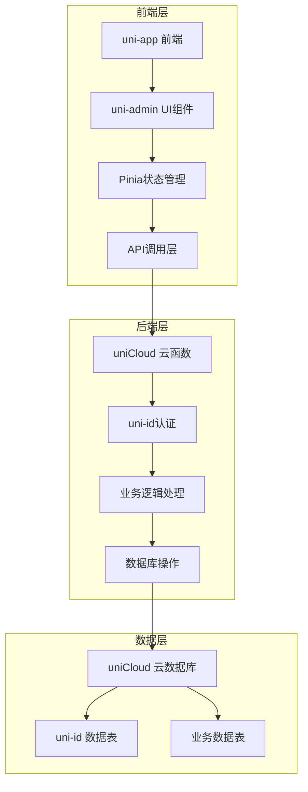

# 多店铺ERP系统 - uniadmin 优化开发方案

## 一、项目概述

### 1. 项目背景
基于 uni-app 和 uniCloud 开发的多店铺手机实体店铺ERP系统，使用 uniadmin 框架构建后台管理系统。

### 2. 项目目标
- 构建符合 uniadmin 框架规范的完整后台管理系统
- 实现多店铺管理、商品管理、库存管理、销售管理等核心功能
- 提供良好的用户体验和系统性能
- 确保系统安全性和可扩展性

## 二、技术架构设计

### 1. 整体架构



### 2. 技术栈选择

| 分类 | 技术 | 版本 | 选型理由 |
|------|------|------|----------|
| 前端框架 | uni-app | latest | 跨平台开发，支持多端部署 |
| 前端语言 | Vue 3 + TypeScript | Vue 3.4+ | 类型安全，开发效率高 |
| UI组件库 | uni-admin UI | latest | 专为后台管理系统设计，功能丰富 |
| 状态管理 | Pinia | 2.1+ | 轻量级，TypeScript支持好 |
| 构建工具 | Vite | 5.0+ | 快速构建，热更新 |
| 后端服务 | uniCloud | latest | Serverless架构，无需运维 |
| 数据库 | uniCloud 云数据库 | latest | MongoDB兼容，操作简便 |
| 认证系统 | uni-id | latest | 完整的用户认证和权限管理 |

### 3. 目录结构设计

```
┌── uniCloud/                           # 云端文件
│   ├── cloudfunctions/                 # 云函数
│   │   ├── common/                     # 公共模块
│   │   │   └── uni-config-center/      # 配置中心
│   │   ├── uni-id/                     # uni-id 认证
│   │   ├── user/                       # 用户管理
│   │   ├── shop/                       # 店铺管理
│   │   ├── product/                    # 商品管理
│   │   ├── inventory/                  # 库存管理
│   │   ├── sales/                      # 销售管理
│   │   ├── finance/                    # 财务管理
│   │   └── report/                     # 报表分析
│   └── database/                       # 数据库
│       ├── schema/                     # 数据表结构
│       └── db-init.json                # 数据库初始化
├── common/                             # 公共资源
│   ├── admin-icons.css                 # 图标样式
│   ├── theme.scss                      # 主题样式
│   └── uni.css                         # 公共样式
├── components/                         # 组件
│   ├── layout/                         # 布局组件
│   ├── form/                           # 表单组件
│   └── business/                       # 业务组件
├── pages/                              # 页面
│   ├── index/                          # 首页
│   ├── system/                         # 系统管理
│   │   ├── user/                       # 用户管理
│   │   ├── role/                       # 角色管理
│   │   ├── menu/                       # 菜单管理
│   │   └── permission/                 # 权限管理
│   ├── shop/                           # 店铺管理
│   ├── product/                        # 商品管理
│   ├── inventory/                      # 库存管理
│   ├── sales/                          # 销售管理
│   ├── finance/                        # 财务管理
│   └── report/                         # 报表分析
├── static/                             # 静态资源
├── uni_modules/                        # 插件模块
├── admin.config.js                     # 管理配置
├── App.vue                             # 应用入口
├── main.ts                             # 主入口文件
├── manifest.json                       # 应用配置
├── pages.json                          # 页面配置
├── tsconfig.json                       # TypeScript配置
├── vite.config.ts                      # Vite配置
└── package.json                        # 项目依赖
```

## 三、开发计划优化

### 1. 阶段划分优化

| 阶段 | 时间 | 主要任务 | 里程碑 |
|------|------|----------|--------|
| **阶段一：项目准备** | 2天 | 项目初始化、环境配置、目录结构搭建 | 项目环境就绪 |
| **阶段二：核心架构** | 3天 | 数据库Schema设计、uni-id集成、核心云函数开发 | 架构搭建完成 |
| **阶段三：系统管理** | 5天 | 用户管理、角色管理、菜单管理、权限管理 | 系统管理模块完成 |
| **阶段四：业务功能** | 8天 | 店铺管理、商品管理、库存管理、销售管理 | 核心业务功能完成 |
| **阶段五：扩展功能** | 4天 | 财务管理、报表分析、数据统计 | 扩展功能完成 |
| **阶段六：前端开发** | 5天 | 页面开发、组件开发、权限控制 | 前端功能完成 |
| **阶段七：测试优化** | 3天 | 功能测试、性能优化、安全加固 | 系统优化完成 |
| **阶段八：部署上线** | 2天 | 云函数部署、前端部署、系统上线 | 系统正式上线 |
| **总计** | 32天 | 完整的 uniadmin 后台系统 | - |

### 2. 核心功能开发计划

#### 阶段一：项目准备
- **Day 1-2**
  - 使用 HBuilderX 创建 uniadmin 项目模板
  - 关联 uniCloud 服务空间
  - 配置项目基本信息
  - 搭建完整目录结构
  - 配置 `admin.config.js`、`manifest.json`、`pages.json`

#### 阶段二：核心架构
- **Day 3-5**
  - 创建数据库Schema文件
  - 集成 uni-id 认证系统
  - 开发核心云函数框架
  - 配置数据权限
  - 实现基础API接口

#### 阶段三：系统管理
- **Day 6-10**
  - 用户管理模块（CRUD、状态管理）
  - 角色管理模块（创建、权限分配）
  - 菜单管理模块（动态菜单、权限控制）
  - 权限管理模块（权限设置、验证）
  - 系统设置模块（基础配置）

#### 阶段四：业务功能
- **Day 11-18**
  - 店铺管理模块（店铺CRUD、状态管理）
  - 商品管理模块（商品CRUD、分类管理）
  - 库存管理模块（库存查询、入库出库、盘点）
  - 销售管理模块（订单管理、收银台、会员管理）

#### 阶段五：扩展功能
- **Day 19-22**
  - 财务管理模块（收支管理、利润分析）
  - 报表分析模块（销售报表、库存报表、财务报表）
  - 数据统计模块（销售统计、趋势分析）

#### 阶段六：前端开发
- **Day 23-27**
  - 系统管理页面开发
  - 业务功能页面开发
  - 报表页面开发
  - 组件开发和优化
  - 权限控制实现

#### 阶段七：测试优化
- **Day 28-30**
  - 功能测试和bug修复
  - 性能优化（前端、后端）
  - 安全加固
  - 用户体验优化

#### 阶段八：部署上线
- **Day 31-32**
  - 云函数部署
  - 前端部署
  - 系统上线
  - 运维文档编写

## 四、技术实现方案

### 1. 数据库设计

#### 核心数据表
- **uni-id-users** - 用户表（uni-id 内置）
- **opendb-admin-roles** - 角色表（uni-admin 内置）
- **opendb-admin-menus** - 菜单表（uni-admin 内置）
- **shop** - 店铺表
- **product** - 商品表
- **category** - 商品分类表
- **inventory_record** - 库存记录表
- **sales_order** - 销售订单表
- **member** - 会员表
- **supplier** - 供应商表
- **finance_record** - 财务记录表

#### 数据权限配置
- 基于角色的权限控制
- 店铺数据隔离
- 字段级权限控制

### 2. 云函数设计

#### 核心云函数
- **uni-id** - 用户认证和权限管理
- **user** - 用户管理
- **shop** - 店铺管理
- **product** - 商品管理
- **inventory** - 库存管理
- **sales** - 销售管理
- **finance** - 财务管理
- **report** - 报表分析

#### API设计规范
- 统一响应格式
- RESTful API 设计
- 错误处理机制
- 权限验证中间件

### 3. 前端实现

#### 页面设计
- 响应式布局，适配PC和移动端
- 统一的设计风格
- 友好的用户界面

#### 组件开发
- 可复用的业务组件
- 表单组件
- 数据展示组件
- 图表组件

#### 权限控制
- 页面权限
- 按钮权限
- 数据权限
- 动态菜单

## 五、优化策略

### 1. 性能优化
- 云函数冷启动优化
- 数据库查询优化
- 前端资源优化
- 缓存策略

### 2. 安全优化
- 数据加密
- 权限验证
- 防SQL注入
- 防XSS攻击

### 3. 开发效率优化
- 代码生成工具（schema2code）
- 组件复用
- 模块化开发
- 自动化测试

## 六、风险评估与应对

| 风险 | 可能性 | 影响 | 应对措施 |
|------|--------|------|----------|
| uniCloud 服务不稳定 | 低 | 高 | 监控系统、备份方案 |
| 云函数超时 | 中 | 中 | 优化云函数、异步处理 |
| 数据库性能瓶颈 | 中 | 高 | 索引优化、查询优化 |
| 权限控制漏洞 | 低 | 高 | 严格的权限验证、定期审计 |
| 前端性能问题 | 中 | 中 | 代码分割、懒加载、缓存 |

## 七、预期成果

1. **完整的 uniadmin 后台管理系统**
   - 符合 uniadmin 框架规范
   - 完整的功能模块
   - 良好的用户体验

2. **技术成果**
   - 模块化的代码结构
   - 完善的API文档
   - 自动化测试用例

3. **业务价值**
   - 提高店铺管理效率
   - 优化库存管理
   - 提升销售管理水平
   - 提供数据决策支持

## 八、开发团队配置

| 角色 | 职责 | 人数 |
|------|------|------|
| 项目经理 | 项目管理、协调 | 1 |
| 前端开发 | 前端页面开发、组件开发 | 2 |
| 后端开发 | 云函数开发、数据库设计 | 2 |
| 测试工程师 | 功能测试、性能测试 | 1 |
| UI设计师 | 界面设计、用户体验 | 1 |
| **总计** | - | **7** |

## 九、验收标准

1. **功能验收**
   - 所有功能模块正常运行
   - 权限控制有效
   - 数据管理准确

2. **性能验收**
   - 页面加载时间 < 2s
   - 云函数响应时间 < 500ms
   - 数据库查询时间 < 200ms

3. **安全验收**
   - 权限验证通过
   - 数据加密有效
   - 无安全漏洞

4. **代码质量**
   - 代码规范
   - 测试覆盖率 > 80%
   - 文档完整

---

**结论**：本优化方案通过合理的阶段划分、详细的技术实现和全面的风险评估，确保了多店铺ERP系统的顺利开发和高质量交付。采用 uniadmin 框架作为基础，结合现代化的开发技术，可以快速构建出功能完善、性能优异的后台管理系统。
